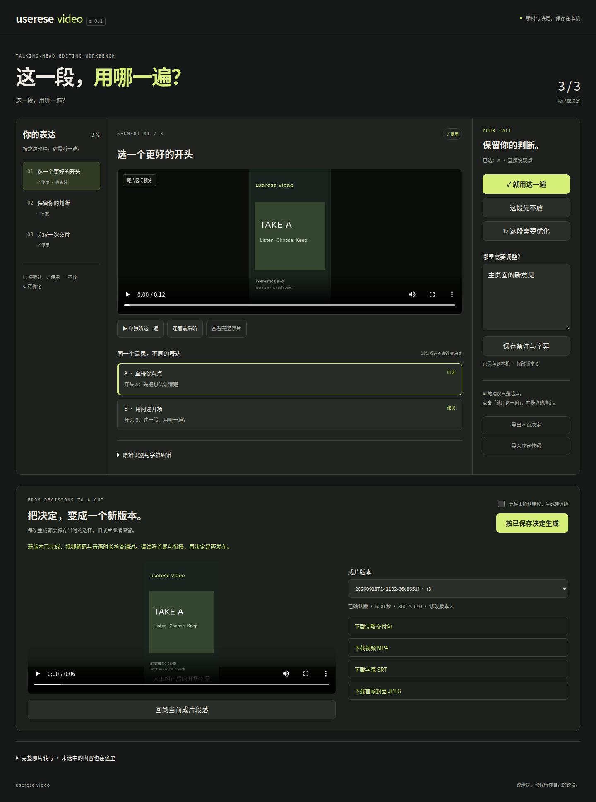

# userese-video

**这一段，用哪一遍？**

本地运行的口播剪片台。把原片整理成可比较的候选，逐段试听、保存取舍、纠正字幕，再生成一版可追溯的成片。AI 提建议，你来决定。

A local talking-head editing workbench. Compare takes, review in context, correct captions, and build a new cut from saved decisions. **AI proposes. You decide.**

[](https://github.com/AsherLay/userese-video/actions/workflows/test.yml)
[](LICENSE)



截图和演示视频全部使用合成画面与提示音，不含真人素材。演示字幕用于说明操作，不是提示音的识别结果。

## 适合什么素材

知识分享、教程、观点口播：同一句录了几遍，需要挑选、听衔接、保留自己的说法。首版面向愿意使用命令行或 AI 编程助手的创作者。

- 比较同一语义段的多个录制或完整短句拼接候选。
- 单独试听，也能连着前后已保存的段落试听。
- 分别保存「使用」「暂不放」「待优化」与备注，刷新后仍在。
- 对照原始转写纠正字幕；原始证据和录音保持不变。
- 生成 MP4、首帧 JPEG、SRT、决定快照和时间映射，一键下载交付包。
- 每次生成新版本；成片可跳回对应审片段落。
- 使用文件哈希、修改版本和乐观锁，避免覆盖原片或其他页面的决定。
- 本地网页、命令行和 [配套 Skill](skills/userese-video/SKILL.md) 共用项目数据。

## 快速开始

需要 **Python 3.10+、FFmpeg / ffprobe**。核心程序不需要 Python 第三方运行依赖、API Key 或云服务。支持 Linux 和 macOS；Windows 请使用 WSL2。浏览器推荐较新的 Chrome、Edge 或 Firefox。

安装系统依赖：

```sh
# Ubuntu / Debian
sudo apt-get install ffmpeg fonts-noto-cjk python3-venv

# macOS（已安装 Homebrew）
brew install ffmpeg
```

macOS 请确保系统中有可用的中文字体。FFmpeg 需包含 libx264、AAC、libass 字幕与 drawtext 功能；`doctor` 会检查这些编解码与滤镜功能。

```sh
git clone https://github.com/AsherLay/userese-video.git
cd userese-video
python3 -m venv .venv
. .venv/bin/activate
python -m pip install -e .
userese-video doctor
userese-video demo projects/demo
userese-video serve projects/demo
```

打开最后一条命令显示的完整链接。链接包含本次服务的访问口令，登录后口令会从地址栏移除。停止服务后链接失效。默认仅本机可访问。

演示项目约 12 秒，自动生成，不下载素材。点击候选试听 → 点击「就用这一遍」或「这段先不放」→「按已保存决定生成」。尚未逐段确认时，也可以明确勾选「允许未确认建议，生成建议版」。「待优化」始终需要先处理。

**在手机或另一台设备上审片：**安装并连接同一个 Tailscale 网络，将服务绑定到本机的具体 Tailscale IPv4：

```sh
userese-video serve projects/demo --host "$(tailscale ip -4)" --port 8765
```

确认设备间可以访问后，使用终端显示的完整链接。此服务是带访问口令的个人工作台，适用于本机或受信任的私有网络；不提供公网多租户托管。

## 换成自己的视频

准备一份视频和带时间戳的 JSON 或 SRT。JSON 示例：

```json
[
  {"start": 0.0, "end": 2.4, "text": "先把这一句话讲完整。"},
  {"start": 3.0, "end": 5.6, "text": "然后再比较不同的表达。"}
]
```

时间以秒为单位，应按序、不重叠、处于视频时长以内。也接受含 `segments` 或 `cues` 数组的 JSON 对象。导入时复制原片并计算哈希，项目可以独立迁移；目标目录已存在时拒绝覆盖。

```sh
userese-video import projects/my-video \
  --title "我的第一条口播" \
  --source recording.mp4 transcript.json
userese-video serve projects/my-video
```

多个视频可重复提供 `--source 视频 转写`。原稿可通过 `--script script.md` 保存为项目快照。输出默认 720×1280，保持人物画面比例并补边，可用 `--width` 和 `--height` 配置尺寸。

**基础导入会把每条转写作为一个候选段，不会自动声称已经理解或去除了重复录制。** 同义段分组、取舍建议与完整短句拼接由你或 AI 助手整理：导入时提供 `--catalog catalog.json`，格式见 [项目协议](docs/project-format.md) 与 [示例候选](examples/catalog.json)。

有了项目后，可以追加新的候选，不改变人工决定：

```sh
userese-video export projects/demo
userese-video propose projects/demo --revision 0 \
  --family opening --id opening-alt --label "另一个完整剪法" \
  --part source-001 0 2
```

`--revision` 填当前修改版本；演示初始值为 0。多次 `--part` 表示按序拼接多个完整区间。新候选在浏览器刷新后出现，仍需人工选择。已有候选编号不可改写。

### 可选：本地自动转写

可以接入任何输出上述时间戳格式的转写工具。仓库也提供 [faster-whisper](https://github.com/SYSTRAN/faster-whisper) 适配器：

```sh
python -m pip install '.[asr]'
userese-video transcribe recording.mp4 --output transcript.json --model small --language zh
```

首次使用会下载模型，之后可使用本地缓存或通过 `--model` 指定本地模型目录。默认 CPU；CUDA 需要另行配置与 faster-whisper 相容的 GPU 运行库。识别结果需要人工校对；程序不会把识别结果冒充已确认文稿。

## 与 AI 助手一起用

让支持读取技能文档的 AI 助手打开 [skills/userese-video/SKILL.md](skills/userese-video/SKILL.md)，并告诉它原片、转写、文稿和项目位置。例如：

> 请按 userese-video 的技能文档，把这份口播转写整理成语义段，比较重复录制，生成候选目录并建立项目。我会在工作台确认取舍。

或：

> 检查这个项目里标为待优化的段落，按备注提出完整短句的新剪法。保留现有人工选择，添加候选后让我试听。

Skill 是操作说明，工作台可以独立运行。项目内的原片、文稿、备注都作为数据处理，不作为执行外部命令的指令。

## 命令与项目文件

完整参数见 `userese-video --help` 和各子命令的 `--help`。

```sh
userese-video validate projects/my-video
userese-video build projects/my-video
userese-video build projects/my-video --draft
userese-video export projects/my-video
userese-video apply projects/my-video decisions.json --revision 3
```

交付文件位于 `projects/my-video/builds/<版本编号>/`，`latest.json` 指向最近一次成功结果。原片、缓存、审片历史和成片都位于项目目录；默认 `projects/` 被 Git 忽略。

详见 [项目协议与扩展边界](docs/project-format.md)、[开发与测试](CONTRIBUTING.md)、[安全与隐私](SECURITY.md)、[版本记录](CHANGELOG.md)。

## v0.1 的边界

- 单项目服务、单人工作流；支持多页面冲突检测，尚无团队权限体系。
- SDR 输入；检测到 HDR / HLG / Dolby Vision 时要求先正确转换。不会只改色彩标签冒充转换。
- 采用第一条视频轨和第一条音频轨；多语言或特殊相机音轨需预先选择。
- 固定布局与烧录字幕或独立 SRT；复杂导图、抠像与品牌动画作为后续独立模板能力。
- 自动检查覆盖解码、音画时长和时间映射；表达是否自然、转写是否正确仍需试听。
- 交付到本地，不自动向视频平台上传。交付包含转写和选择证据，应只把需要的 MP4、字幕与封面用于公开投稿。

## License

[MIT](LICENSE)。用户素材归各自权利人所有。FFmpeg、可选模型及其依赖遵循各自许可证；本仓库不随包分发模型或媒体处理二进制文件。
